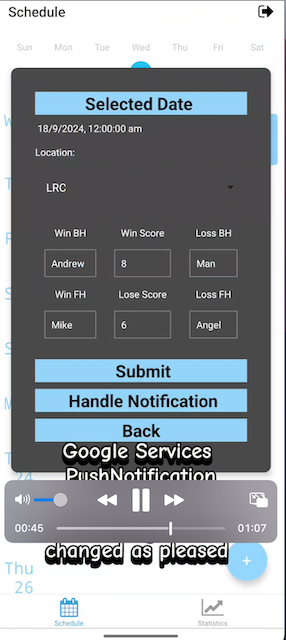

### Download the Test build 

[Link Text](https://expo.dev/accounts/luluyip/projects/my-nav-app/builds/90eccb76-dbb6-418b-8622-4760b77f3adf)

Android Test Build :  

# Packages
firebase 10.6.0
react-native 0.71.7 -> XCode requires 14.3 further (not available from current machine)

# Reminders 
26/09/2024

using DNS to hash matchID with date 
Finish project ASAP 
1. Add/Edit function connect to firebase ( without input validation, unless understand the process)
2. handle re-rendering of agenda table 
3. add the notification demo, in the modal page ? Perhaps take the add_game_score screen out to get the back button back 
4. create a presentation or demo video for Kelvin and Chi to take a look, get to know Wilson a lil more. 

21/10/2024
1. Add/Edit functions need validators for inputs
2. Fix the Add page dark mode
3. Add the Pie Chart. 
4. Fix the notification functions, add in some features of notification demo showcases 

# Summary 

A Tennis app to allow users to record their playing game scores and analyize players performance. 

# Architecture 
- Front-End: React-Native with Expo template

- Back-End: Google Firebase service

# Build Guide

### Start the project 
Run `yarn start`
`yarn install`

- Before your start the project, you need a google-services.json to allow the notification function to work. 
Create your own firebase services. 
